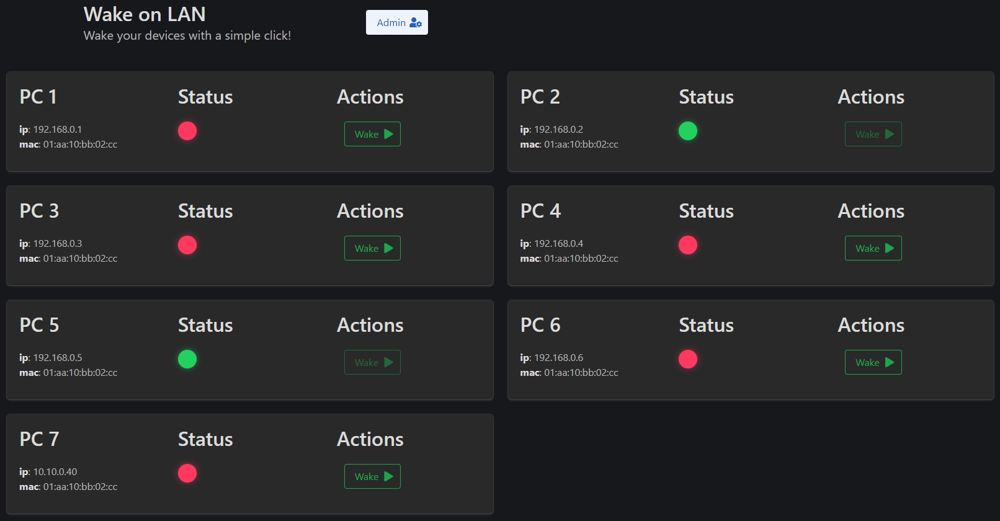
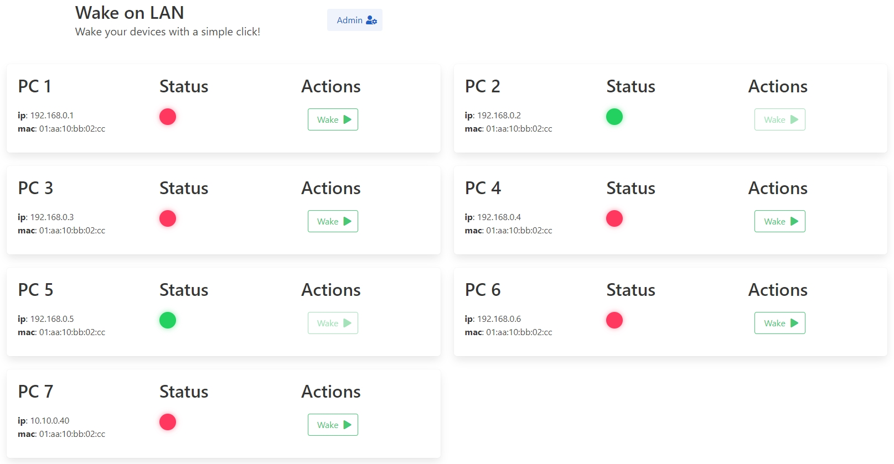

# Django Wake on LAN

| Dark                 | Light                 |
| -------------------- | --------------------- |
|  |  |

## Installation

1. Clone this repo

`git clone https://github.com/seriousm4x/django-wake-on-lan.git`

2. Copy "TEMPLATE.env" to ".env" and edit it.

3. Run the container

`docker-compose up -d`

## Manage devices

Click on the `Admin` button and login with your credentials from your env file. Once logged in you can manage your devices there.
